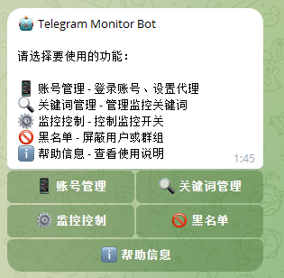

# Telegram Monitor Bot

简洁高效的 Telegram 消息监控工具，全可视化操作，无需记忆任何命令。



## ✨ 功能亮点

- 🎯 **关键词监控** - 支持精确匹配、模糊匹配、正则表达式等多种匹配模式
- 📱 **全按钮操作** - 纯可视化界面，点击即用，零学习成本
- 🔄 **实时监听** - 匹配消息即时推送到你的 Bot
- 📦 **批量导入导出** - 关键词支持批量导入导出，迁移备份更方便
- ⚡ **快捷屏蔽** - 转发消息一键屏蔽用户或群组
- 🚫 **黑名单设过滤** - 屏蔽指定用户或群组的消息
- 🛡️ **设备指纹伪装** - 模拟真实设备登录，降低风控风险
- 🌐 **代理支持** - 支持 Socks5、MTProxy 代理
- 🔒 **私有化部署** - 部署在自己服务器，账号数据完全自主掌控
- 📖 **完全开源** - 代码开源透明，支持安全审计


## 🚀 快速开始

### 📥 下载

| 平台 | 下载链接 |
|------|----------|
| 🐳 Docker | `docker pull luoyanglang/telegram-monitor:latest` |
| 🐧 Linux | [下载 Linux 版本](https://github.com/luoyanglang/TelegramMonitor/releases/latest) |
| 🪟 Windows | [下载 Windows 版本](https://github.com/luoyanglang/TelegramMonitor/releases/latest) |
| 📦 源码 | [下载源码](https://github.com/luoyanglang/TelegramMonitor/archive/refs/heads/main.zip) |

### 1. 准备工作

你需要准备以下信息（[获取教程](wiki/config/bot-token.md)）：
- Telegram Bot Token
- Telegram API ID 和 API Hash
- 你的 Telegram 用户 ID

### 2. 部署运行

**Docker 部署（推荐）**
```bash
docker run -d \
  --name telegram-monitor \
  -e BOT_TOKEN=你的Token \
  -e TELEGRAM_API_ID=你的API_ID \
  -e TELEGRAM_API_HASH=你的API_Hash \
  -e AUTHORIZED_USER_ID=你的用户ID \
  luoyanglang/telegram-monitor:latest
```

### 3. 开始使用

1. 在 Telegram 中找到你的 Bot
2. 发送 `/start`
3. 按菜单提示操作即可

## 📚 文档

| 文档 | 说明 |
|------|------|
| [部署指南](wiki/index.md#部署指南) | Docker、1Panel、宝塔、源码等多种部署方式 |
| [配置说明](wiki/index.md#配置说明) | Bot Token、API 凭证、代理等配置获取与设置 |
| [使用教程](wiki/index.md#使用教程) | 账号管理、关键词、监控、黑名单等功能详解 |
| [常见问题](wiki/faq.md) | 遇到问题先看这里 |

## 📢 交流反馈

- 频道：[狼哥发布频道](https://t.me/langgefabu)
- 群组：[狼哥交流群](https://t.me/langgepython)

## ⚠️ 安全提示

- 本程序仅监听你已加入的群组、频道和私聊
- 请妥善保管 Bot Token 和 API 凭证，避免泄露
- 请遵守 Telegram 服务条款和当地法律法规

## 📄 许可证

[GPL-3.0](LICENSE)
