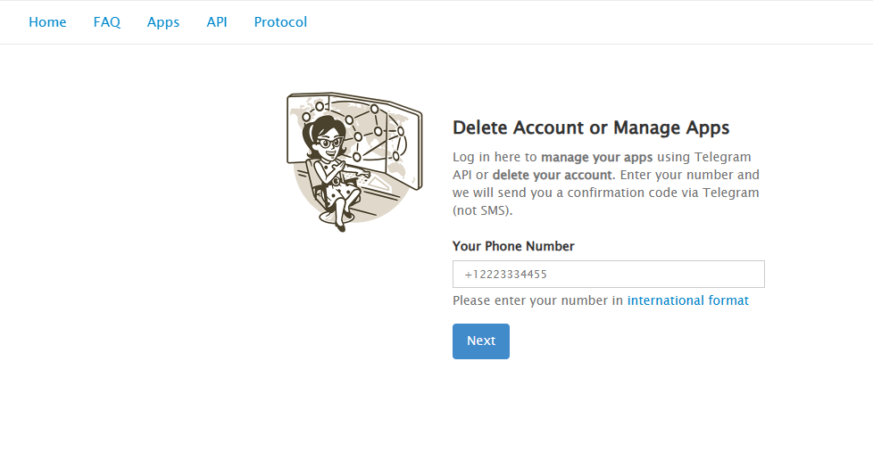
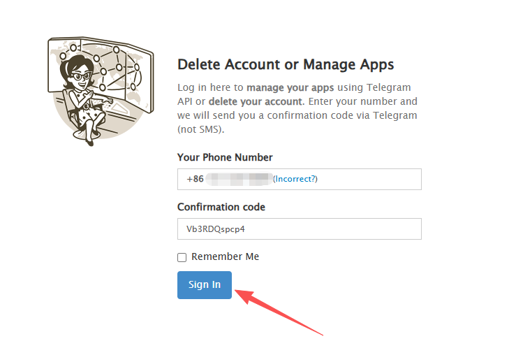
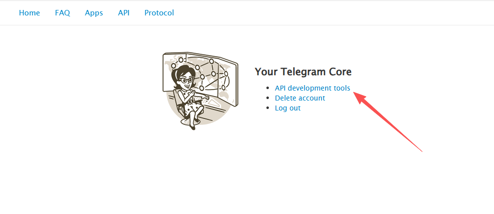
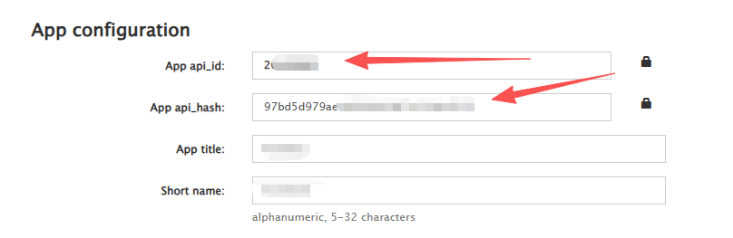

# 获取 API ID 和 API Hash

API ID 和 API Hash 是 Telegram 官方提供的开发者凭证，用于登录你的 Telegram 账号进行消息监听。

## 获取步骤

### 1. 访问 Telegram 开发者平台

打开 [https://my.telegram.org](https://my.telegram.org)

### 2. 登录账号

输入你的手机号（带国际区号，如 `+86 13800138000`），然后输入收到的验证码。

### 3. 进入 API 开发工具

登录后点击 **API development tools**。

### 4. 创建应用

如果是首次使用，需要填写应用信息：

| 字段 | 填写内容 |
|------|----------|
| App title | 随便填，如 `MyApp` |
| Short name | 随便填，如 `myapp` |
| Platform | 选择 `Desktop` |
| Description | 可以留空 |

### 5. 获取凭证

创建成功后，页面会显示：

- **App api_id** - 一串数字，如 `12345678`
- **App api_hash** - 一串字母数字，如 `abcdef1234567890abcdef1234567890`

⚠️ **请妥善保管这些凭证，不要泄露给他人！**

## 注意事项

- 每个 Telegram 账号只能创建一个应用
- API 凭证创建后无法删除，但可以修改应用信息
- 如果忘记凭证，重新登录 my.telegram.org 即可查看

---

[← 返回文档首页](../index.md)
