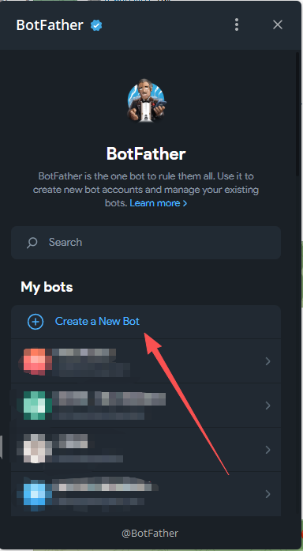
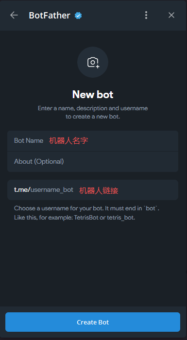
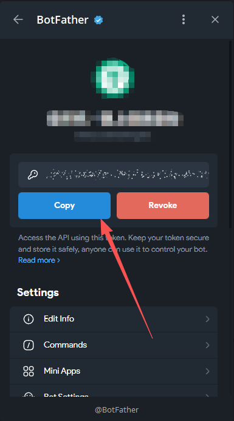

# 获取 Bot Token

Bot Token 是你的 Bot 的唯一凭证，用于控制 Bot 接收和发送消息。

## 创建步骤

### 1. 打开 BotFather

在 Telegram 中搜索 [@BotFather](https://t.me/BotFather) 并打开对话。



### 2. 创建新 Bot

发送 `/newbot` 命令，BotFather 会引导你完成创建：

1. 输入 Bot 的显示名称（如：`我的监控Bot`）
2. 输入 Bot 的用户名（必须以 `bot` 结尾，如：`my_monitor_bot`）



### 3. 获取 Token

创建成功后，BotFather 会返回一个 Token，格式类似：

```
123456789:ABCdefGHIjklMNOpqrsTUVwxyz
```



⚠️ **请妥善保管此 Token，不要泄露给他人！**

## 其他操作

### 修改 Bot 信息

- `/setname` - 修改显示名称
- `/setdescription` - 修改描述
- `/setabouttext` - 修改简介
- `/setuserpic` - 修改头像

### 重新获取 Token

如果 Token 泄露，可以发送 `/revoke` 重新生成。

---

[← 返回文档首页](../index.md)
