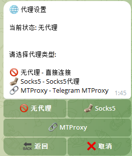

# 代理配置

如果你的服务器无法直接访问 Telegram，需要配置代理。

## 支持的代理类型

- HTTP 代理
- SOCKS5 代理

## 配置方法

在环境变量中添加代理配置：

```env
# HTTP 代理
PROXY_TYPE=http
PROXY_HOST=127.0.0.1
PROXY_PORT=7890

# 或 SOCKS5 代理
PROXY_TYPE=socks5
PROXY_HOST=127.0.0.1
PROXY_PORT=1080

# 如果代理需要认证（可选）
PROXY_USERNAME=your_username
PROXY_PASSWORD=your_password
```

## Docker 部署时配置代理

```bash
docker run -d \
  --name telegram-monitor \
  -e BOT_TOKEN=你的Token \
  -e TELEGRAM_API_ID=你的API_ID \
  -e TELEGRAM_API_HASH=你的API_Hash \
  -e AUTHORIZED_USER_ID=你的用户ID \
  -e PROXY_TYPE=socks5 \
  -e PROXY_HOST=127.0.0.1 \
  -e PROXY_PORT=1080 \
  luoyanglang/telegram-monitor:latest
```

## 常见问题

### 代理连接失败

1. 检查代理服务是否正常运行
2. 检查代理地址和端口是否正确
3. 如果使用 Docker，注意 `127.0.0.1` 指向的是容器内部，应使用宿主机 IP 或 `host.docker.internal`

### 国内服务器推荐

如果服务器在国内，建议：
- 使用境外服务器部署
- 或在服务器上搭建代理服务

---

[← 返回文档首页](../index.md)
