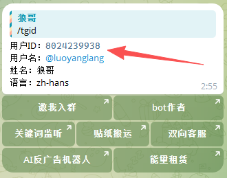

# 获取用户 ID

用户 ID 是你的 Telegram 账号的唯一数字标识，用于授权访问 Bot。

## 获取方法

### 方法一：使用 @userinfobot（推荐）

1. 在 Telegram 中搜索 [@chaxunlianshangbot](https://t.me/chaxunlianshangbot)
2. 点击 **Start** 或发送 /tgid
3. Bot 会返回你的用户信息，其中 **Id** 就是你的用户 ID




## 用户 ID 格式

用户 ID 是一串纯数字，如：

```
123456789
```

⚠️ **注意**：用户 ID 不是用户名（@username），不要搞混了。

---

[← 返回文档首页](../index.md)
