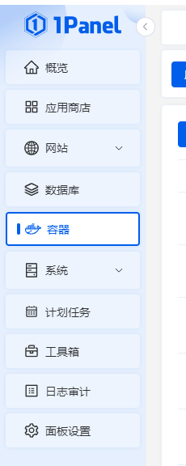
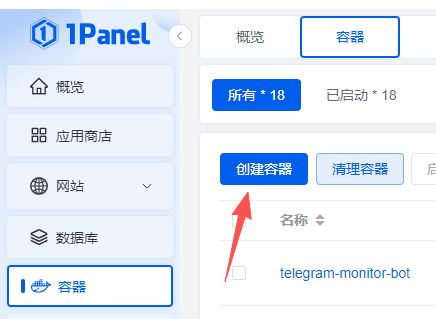
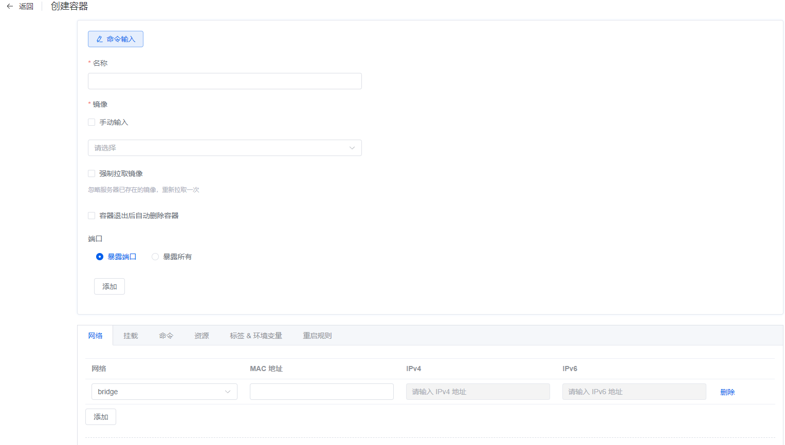
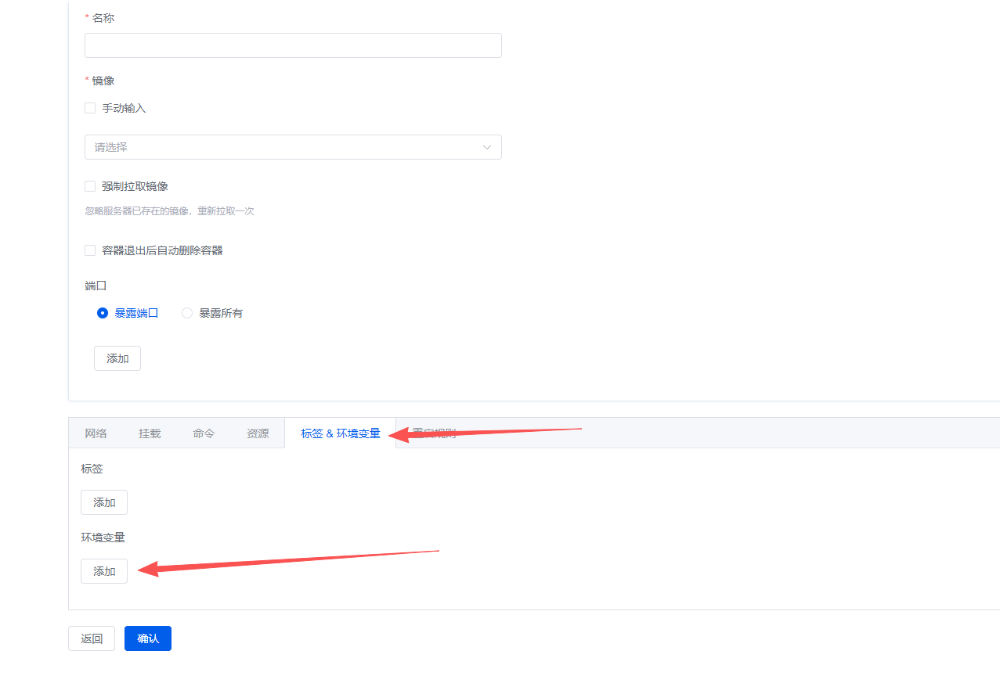
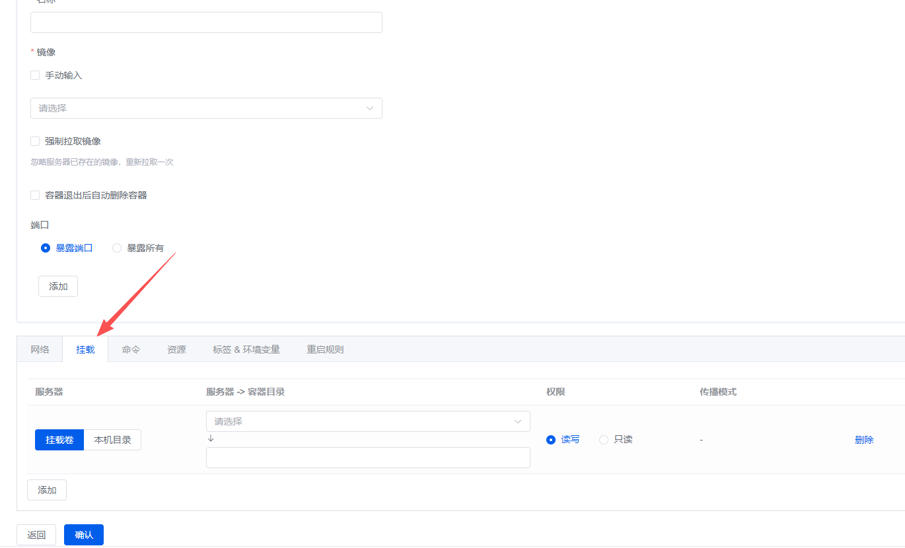
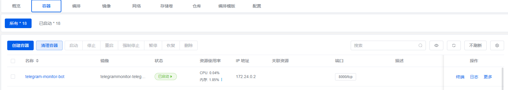
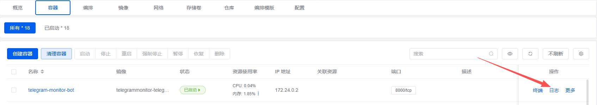

# 1Panel 面板部署

1Panel 是一款现代化的 Linux 服务器运维管理面板，本教程手把手教你部署。

## 前提条件

- 已安装 1Panel 面板
- 已准备好配置信息（[获取教程](../config/bot-token.md)）

## 部署步骤

### 1. 进入容器管理

登录 1Panel 面板，点击左侧菜单 **容器** → **容器**。

### 2. 创建容器

点击 **创建容器** 按钮。

### 3. 填写基本信息

| 字段 | 填写内容 |
|------|----------|
| 名称 | `telegram-monitor` |
| 镜像 | `luoyanglangge/telegram-monitor:latest` |
| 重启策略 | `unless-stopped` |

### 4. 配置环境变量

在 **环境变量** 部分，点击添加，依次添加：

| 变量名 | 值 |
|--------|-----|
| `BOT_TOKEN` | 你的 Bot Token |
| `TELEGRAM_API_ID` | 你的 API ID |
| `TELEGRAM_API_HASH` | 你的 API Hash |
| `AUTHORIZED_USER_ID` | 你的用户 ID |

### 5. 配置数据持久化（可选但推荐）

在 **挂载** 部分，点击添加目录映射：

| 服务器 | 容器目录 |
|--------|----------|
| `/opt/telegram-monitor/data` | `/app/data` |
| `/opt/telegram-monitor/sessions` | `/app/sessions` |

### 6. 创建并启动

点击 **确认** 按钮，等待镜像拉取完成后容器会自动启动。

### 7. 查看日志

在容器列表中，点击对应容器右侧的 **日志** 按钮查看运行日志。

## 开始使用

部署成功后，在 Telegram 中找到你的 Bot，发送 `/start` 开始使用。

## 常见问题

### 镜像拉取失败

可能是网络问题，尝试：
1. 在 1Panel 中配置 Docker 镜像加速
2. 或手动拉取：终端执行 `docker pull luoyanglangge/telegram-monitor:latest`

### 容器启动后立即停止

查看容器日志，通常是环境变量配置错误。

---

[← 返回文档首页](../index.md)
