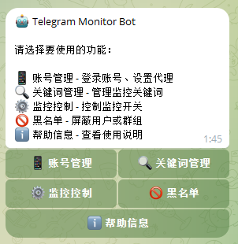
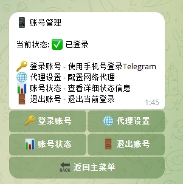

# 账号管理

账号管理用于登录你的 Telegram 账号，Bot 需要通过你的账号来监听消息。

## 进入账号管理

在 Bot 主菜单点击 **📱 账号管理**。

## 功能介绍

### 登录账号

1. 点击 **🔐 登录账号**
2. 按提示输入手机号（带国际区号，如 `+8613800138000`）
3. 输入收到的验证码
4. 如果开启了两步验证，还需输入密码

登录成功后会显示账号信息。

### 查看状态

点击 **📊 查看状态** 可以查看：
- 当前登录状态
- 账号信息
- 会话有效期

### 退出登录

点击 **🚪 退出登录** 可以注销当前会话。

⚠️ 退出后需要重新登录才能继续监控。

### 代理设置

如果需要通过代理连接 Telegram，点击 **🌐 代理设置**。

详细配置请参考 [代理配置](../config/proxy.md)。

## 常见问题

### 验证码收不到

- 检查手机号是否正确
- 稍等片刻，验证码可能有延迟
- 尝试重新发起登录

### 登录后掉线

- 检查网络连接
- 如果使用代理，检查代理是否正常
- 重新登录即可

---

[← 返回文档首页](../index.md)
