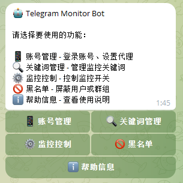
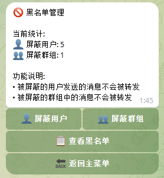

# 黑名单管理

黑名单用于屏蔽特定用户或群组的消息，被屏蔽的来源即使匹配关键词也不会转发。

## 进入黑名单管理

在 Bot 主菜单点击 **🚫 黑名单管理**。

## 功能介绍

### 黑名单列表

显示所有已添加的黑名单项，包括：
- 用户黑名单
- 群组黑名单

### 添加黑名单

#### 添加用户黑名单

1. 点击 **➕ 添加用户**
2. 输入用户 ID 或用户名

#### 添加群组黑名单

1. 点击 **➕ 添加群组**
2. 输入群组用户名或链接

### 删除黑名单

在黑名单列表中点击要删除的项，确认删除即可。

## 使用场景

### 屏蔽广告用户

某些用户经常发广告，可以将其加入黑名单。

### 屏蔽特定群组

某个群组消息太多但又不想退出，可以将其加入黑名单暂时屏蔽。

## 注意事项

- 黑名单优先级最高，会覆盖所有关键词规则
- 添加黑名单后立即生效，无需重启监控

---

[← 返回文档首页](../index.md)
