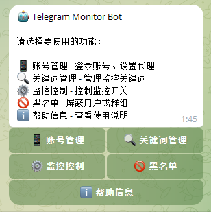
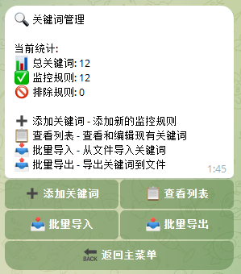
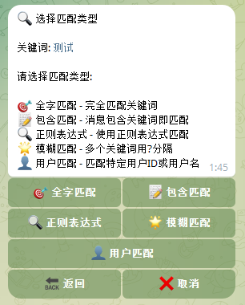
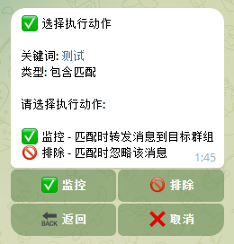
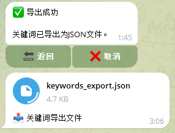
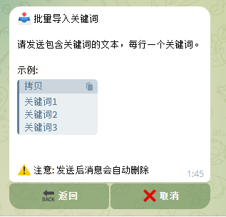

# 关键词管理

关键词是监控的核心，Bot 会根据你设置的关键词规则来筛选和转发消息。

## 进入关键词管理

在 Bot 主菜单点击 **🔍 关键词管理**。

## 关键词列表

列表显示所有已添加的关键词，包括：
- 关键词内容
- 匹配类型
- 动作类型（监控/排除）

## 添加关键词

点击 **➕ 添加关键词**，按提示操作：

### 1. 输入关键词

输入你要监控的关键词或表达式。

### 2. 选择匹配类型

| 类型 | 说明 | 示例 |
|------|------|------|
| **全字匹配** | 消息必须完全等于关键词 | 关键词 `hello` 只匹配 `hello`，不匹配 `hello world` |
| **包含匹配** | 消息包含关键词即可 | 关键词 `hello` 匹配 `say hello to you` |
| **正则表达式** | 使用正则语法匹配 | `\d{11}` 匹配 11 位数字（手机号） |
| **模糊匹配** | 多个词同时出现即匹配 | `出 租` 匹配包含"出"和"租"的消息 |
| **用户匹配** | 匹配特定用户的消息 | 输入用户 ID 或用户名 |

### 3. 选择动作类型

| 动作 | 说明 |
|------|------|
| **监控** | 匹配时转发消息 |
| **排除** | 匹配时忽略消息（优先级高于监控） |

## 编辑关键词

在关键词列表中点击要编辑的关键词，可以修改其内容、匹配类型和动作。

## 删除关键词

在关键词详情页点击 **🗑 删除** 即可删除。

## 使用技巧

### 排除干扰消息

先添加宽泛的监控关键词，再添加排除关键词过滤掉不需要的消息。

例如：
- 监控：`出租`（包含匹配）
- 排除：`广告`（包含匹配）

### 正则表达式示例

| 需求 | 正则表达式 |
|------|-----------|
| 手机号 | `1[3-9]\d{9}` |
| 价格 | `\d+元` |
| 微信号 | `[vV][xX][:：]?\s*\w+` |

## 批量导入导出

支持关键词的批量导入导出，方便备份和迁移。

### 导出关键词

1. 在关键词管理页面点击 **📤 导出**
2. Bot 会发送一个包含所有关键词的文件

### 导入关键词

1. 点击 **📥 导入**
2. 发送之前导出的关键词文件
3. 确认导入

> 💡 导入时会自动跳过已存在的关键词，不会重复添加。

---

[← 返回文档首页](../index.md)
