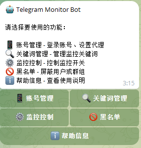
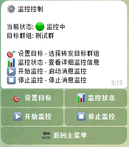
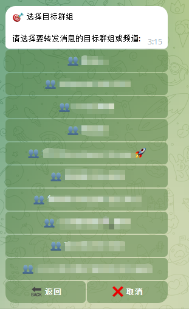
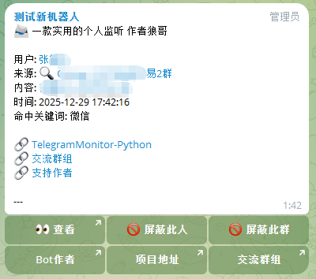

# 监控控制

监控控制用于设置监控目标和启停监控服务。

## 进入监控控制

在 Bot 主菜单点击 **⚙️ 监控控制**。

## 功能介绍

### 监控状态

显示当前监控服务的运行状态：
- 🟢 运行中
- 🔴 已停止

### 启动/停止监控

- 点击 **▶️ 启动监控** 开始监控
- 点击 **⏹ 停止监控** 暂停监控

### 监控目标设置

点击 **🎯 监控目标** 设置要监控的群组或频道。

#### 添加监控目标

1. 点击 **➕ 添加目标**
2. 输入群组/频道的用户名或链接
3. 确认添加

支持的格式：
- 用户名：`@channel_name`
- 链接：`https://t.me/channel_name`
- 私有群组邀请链接：`https://t.me/+xxxxx`

#### 监控全部

如果不设置具体目标，默认监控你已加入的所有群组和频道。

### 查看统计

点击 **📊 统计信息** 查看：
- 今日匹配消息数
- 总匹配消息数
- 监控运行时长

## 消息转发

当监控到匹配的消息时，Bot 会自动转发到你的对话中，包含：
- 消息来源（群组/频道名称）
- 发送者信息
- 消息内容
- 匹配的关键词

## 常见问题

### 监控不生效

1. 检查是否已登录账号
2. 检查监控是否已启动
3. 检查关键词是否正确设置
4. 确认你已加入要监控的群组

### 消息延迟

正常情况下消息会实时转发，如果有延迟：
- 检查网络连接
- 检查服务器负载

---

[← 返回文档首页](../index.md)
